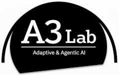
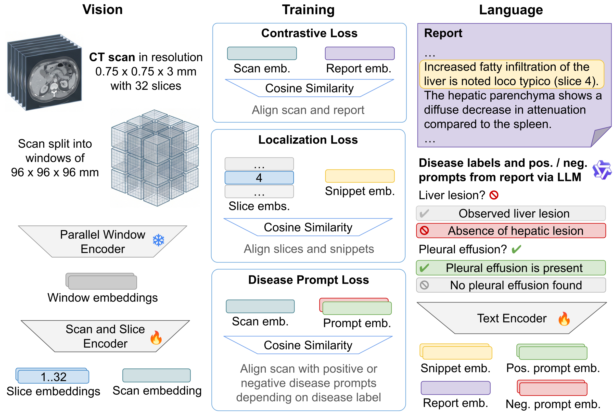

<div align="center">
<a href="https://lmb.informatik.uni-freiburg.de/"></a>
<a href="hhttps://ece.au.dk/forskning/forsknings-og-udviklingsomraader/signal-processing-and-machine-learning/research-groups-alt/adaptive-agentic-ai-a3-la"></a>
<br/>
<a href="https://radfinder.github.io">Project Page</a> —
<a href="https://arxiv.org/abs/2603.02026">Paper</a> —
<a href="https://github.com/lmb-freiburg/radfinder">Code</a> —
<a href="https://huggingface.co/collections/lmb-freiburg/radfinder">Models</a>
<br/>
<a href="https://github.com/lmb-freiburg/radfinder/actions/workflows/build-py312-cpu.yml">
  
</a>
</div>

# RadFinder

_Disease-Aware Vision–Language Pretraining for 3D CT_

We pretrain a 3D CT vision–language model on 159k report–volume pairs with two new supervision signals:
**prompt-based disease labels** for classification and **intra-scan snippet localization** for axial depth grounding.
A single unified model reaches state-of-the-art retrieval on CT-RATE, competitive disease
classification, and slice-level localization at 12 mm resolution.

**To appear at MICCAI 2026.**

<div align="center">

<br/>
<em>Overview of the RadFinder architecture and training pipeline.</em>
</div>

## News

- 15 June 2026: **Code and models** released, including the report structuring pipeline
- 7 May 2026: **Accepted** to MICCAI 2026 (early-acceptance)
- 2 March 2026: **Preprint** published on [arXiv](https://arxiv.org/abs/2603.02026)

## Setup the repository

- Tested with Python=3.12 PyTorch=2.12 CUDA=13.0
- Set environment variables `MEDV_DATA_DIR` (data root) and `MEDV_OUTPUT_DIR` (experiment outputs)
- In case of installation problems, try `pip install -r frozen_pip_requirements.txt` instead.

```bash
conda create -n radfinder python=3.12 -y
conda activate radfinder
python -m ensurepip
pip install -U pip setuptools wheel
pip install -U requirements.txt
pip install -U -e .
```

## Hugging Face model usage

Checkpoints are released on [🤗 Hugging Face](https://huggingface.co/collections/lmb-freiburg/radfinder).
We bundled a demo scan under `assets/demo/s0859/` (thorax-abdomen-pelvis), _inflammation in thorax_ should be found.

```bash
python -m radfinder.cli.hf_example_dummy_input
python -m radfinder.cli.hf_example_real_input

```

A joint forward pass `model(pixel_values=..., input_ids=..., attention_mask=..., grid_size=...)`
returns both embeddings as a single `ModelOutput`. For a quick smoke test with dummy inputs
(no data download needed) see `simple_example.py`.

## Setup datasets as required

See acknowledgements chapter for the links.

```bash
# CT-RATE
$MEDV_DATA_DIR/public/CT-RATE/dataset/
metadata/
train_fixed/
valid_fixed/
radiology_text_reports/
multi_abnormality_labels/

# Inspect
$MEDV_DATA_DIR/public/Inspect/full/

# Merlin
$MEDV_DATA_DIR/public/Merlin/
merlin_data
reports_final.xlsx

# Rad-ChestCT
$MEDV_DATA_DIR/public/Rad-ChestCT/
npz/
*.csv

# verify dataset setup
python -m radfinder.cli.check_train_dataloader
python -m radfinder.cli.check_eval_dataloader

```

## Using evaluation and training code

### Important commandline arguments

- Use `--image_feat_mode` to change input modality
  - `full`: raw scans, `from_spaced_image`: preprocessed scans, `frozen_local`: extracted features
- Note that the SPECTRE zeroshot results in our paper are reported at 0.5x0.5x1.0mm for consistency
  with the original paper, while RadFinder uses 0.75x0.75x3mm.
  - Use `--model_cfg configs/models/spectre_pretrained_dino_res.yaml` to evaluate SPECTRE at 0.5x0.5x1mm
    and to extract spaced images and features at that resolution.
- CT-RATE is run with duplicate reports, to run deduplicated reports: `--ctrate_filter_mode first_all`
- Use `--bootstrap` to calculate confidence intervals.

### Preprocess images

Convert the images to the desired spacing, to not have to load .nii.gz files each time.

```bash
python -m radfinder.cli.save_embeddings --save_spaced_images --dataset ctrate --split val
```

### Extract features

Save the features of the image backbone for faster inference and faster training with a frozen backbone.
RadFinder freezes the SPECTRE image backbone, so both models will produce the same features.

```bash
python -m radfinder.cli.save_embeddings \
  --do_image_backbone --image_feat_mode from_spaced_image --save_sliced_backbone_patches \
  --dataset ctrate --split val
```

### Evaluation

```bash
# run individual tasks using huggingface RadFinder
python -m radfinder.cli.eval_retrieval --dataset_name ctrate --split val
python -m radfinder.cli.eval_volume_retrieval --dataset_name ctrate --split val
python -m radfinder.cli.eval_binary_zs --dataset_name ctrate --split val
python -m radfinder.cli.eval_binary_zs --dataset_name radchestct --split all \
  --radchestct_label_mapping standard --eval_protocol radchestct_standard
python -m radfinder.cli.eval_pool_retrieval --dataset_name merlin --split test

# run all tasks using the trainer
python -m radfinder.cli.train_siglip --train_cfg configs/runs/evals/radfinder_3mm.yaml

# Alternatively you can evaluate with the regular SPECTRE model and a loaded checkpoint.
# This avoids loading the weights and configs from huggingface, and instead loads model_cfg,
# and additional config fields from the training train_cfg.

# the checkpoints can be 1) a trained .ckpt file, 2) a huggingface dir, 3) the huggingface .safetensors file
# to use 2), resolve the checkpoint dir from huggingface:
CKPT=$(hf download lmb-freiburg/radfinder --format quiet)
ls -alhX "$CKPT"
# it will be something like $HF_HOME/hub/models--lmb-freiburg--radfinder/snapshots/$SNAPSHOT/")

python -m radfinder.cli.eval_retrieval --dataset_name ctrate \
  --model_cfg configs/models/spectre_pretrained_half_patch_embed.yaml \
  --train_cfg configs/runs/training/train_radfinder_3mm.yaml \
  --ckpt_file "$CKPT"
```

### Show results

```bash
python -m radfinder.cli.show_results -s evals -g default
```

### Training

The huggingface model does inference only.
To finetune RadFinder, create a non-huggingface model,
and point the checkpoint to the downloaded weights from the HuggingFace repo.

```bash
# finetune starting from radfinder weights
python -m radfinder.cli.train_siglip --train_cfg configs/train/TRAIN_CONFIG.yaml

# finetune starting from spectre weights
python -m radfinder.cli.train_siglip --model_cfg configs/models/spectre_pretrained_half_patch_embed.yaml \
--train_cfg configs/train/TRAIN_CONFIG.yaml
```

## Using modified RATE pipeline to structure free-text reports

See original [RATE codebase](https://github.com/YalaLab/rate) for more details.
Changes: Speed improvements, bugfixes, added support for German language,
renamed duplicate categories and questions.

### Start the LLM

Here we use sglang to run Qwen3-30B-A3B-FP8, however any library compatible with the
openai v1 API and any good LLM should do.

```bash
pip install "sglang[all]"

python -m sglang.launch_server --model-path Qwen/Qwen3-30B-A3B-FP8 --reasoning-parser qwen3 \
  --port 8000 --host 127.0.0.1 --dp 1 --schedule-conservativeness 0.1 --max-running-requests 1024 \
  --tokenizer-worker-num 32 --chunked-prefill-size 16384 --max-prefill-tokens 32768
```

Depending on the speed and batch size of your LLM setup you may want to increase these hardcoded
limits in src/rate/batch_processor_fix_sglang.py: max_connections=1024, max_keepalive_connections=256

### Run the extraction

Use commandline args to change host, port, model name, hyperparameters.
If the model repeatedly fails to process some datapoints, try increasing randomness:
`--temperature 0.7 --top_p 0.9`

```bash
python -m rate.cli.ctrate_cli --split all --stage remove_comparisons_findings
python -m rate.cli.ctrate_cli --split all --stage remove_comparisons_impressions
python -m rate.cli.ctrate_cli --split all --stage map_categories
python -m rate.cli.ctrate_cli --split all --stage questions
python -m rate.cli.ctrate_cli_check

python -m rate.cli.inspect_cli --split all --stage remove_comparisons_impressions
python -m rate.cli.inspect_cli --split all --stage map_categories
python -m rate.cli.inspect_cli --split all --stage questions
python -m rate.cli.inspect_cli_check

python -m rate.cli.merlin_cli --split all --stage remove_comparisons_findings
python -m rate.cli.merlin_cli --split all --stage remove_comparisons_impressions
python -m rate.cli.merlin_cli --split all --stage map_categories
python -m rate.cli.merlin_cli --split all --stage questions
python -m rate.cli.merlin_cli_check
```

## Troubleshooting

```bash
FileNotFoundError: Feature file not found: .../embeddings/images_3mm_ctrate/valid_1_a_2/image_spaced.safetensors.zst
RuntimeError: applying transform <radfinder.transforms.load_features.LoadFeaturesTransformd object at 0x7f4728a800e0>

-> Preprocessed image not found, either preprocess images as described above or change image_feat_mode to full.

FileNotFoundError: Feature file not found: .../embeddings/spectre_3mm_ctrate/train_10005_a_1/image_backbone_cls.safetensors.zst 
RuntimeError: applying transform <radfinder.transforms.load_features.LoadFeaturesTransformd object at 0x7f0c619487a0>

-> Extracted features not found, either extract features as described above or change image_feat_mode to full or from_spaced_image.
```

## Acknowledgements

- The model and parts of the SigLIP training framework in `src/radfinder` are based on [SPECTRE](https://github.com/cclaess/SPECTRE)
- The text processing pipeline in `src/rate` is used to create binary labels based on text reports and is based on [RATE](https://github.com/YalaLab/rate)
- Training data: [CT-RATE](https://huggingface.co/datasets/ibrahimhamamci/CT-RATE) (CC BY-NC-SA 4.0), [Merlin](https://stanfordaimi.azurewebsites.net/) and [INSPECT](https://stanfordaimi.azurewebsites.net/) (Stanford AIMI non-commercial research DUAs).
- We thank the [MONAI](https://project-monai.github.io/), [timm](https://timm.fast.ai/), and
[Hugging Face transformers](https://github.com/huggingface/transformers) maintainers for the libraries
and all other package maintainers listed in `requirements.txt`
- The demo scan under `assets/demo/s0859/` is case `s0859` from [TotalSegmentator v2](https://zenodo.org/records/10047292) (Wasserthal et al., CC-BY-4.0).
- Funding, additional acknowledgements, full citations: see paper.

### License

- All code is MIT (see `LICENSE`) unless a file header says otherwise. Files in
  `src/rate/` that carry a `# Vendored from YalaLab/rate ... (ECL 2.0)` header
  are derivatives of the upstream rate package and are licensed under ECL 2.0
  (see `LICENSE_RATE`).
- RadFinder model weights are CC BY-NC-SA 4.0, see `LICENSE_MODELS`.
  - Note: the weights are subject to the original dataset licenses. Users intending to use RadFinder in commercial settings should verify dataset and model licensing and obtain any required permissions.

## Citation

If you use this code, models, or results, please cite:

```bibtex
@inproceedings{ging2026radfinder,
  author    = {Simon Ging and Philipp Arnold and Sebastian Walter and Hani Alnahas and Hannah Bast and Elmar Kotter and Jiancheng Yang and Behzad Bozorgtabar and Thomas Brox},
  title     = {Learning to Read Where to Look: Disease-Aware Vision--Language Pretraining for 3{D} {CT}},
  booktitle = {Medical Image Computing and Computer Assisted Intervention -- {MICCAI} 2026, Strasbourg, France, September 27 -- October 1, 2026, Proceedings},
  series    = {Lecture Notes in Computer Science},
  publisher = {Springer},
  year      = {2026},
  note      = {To appear},
}
```
